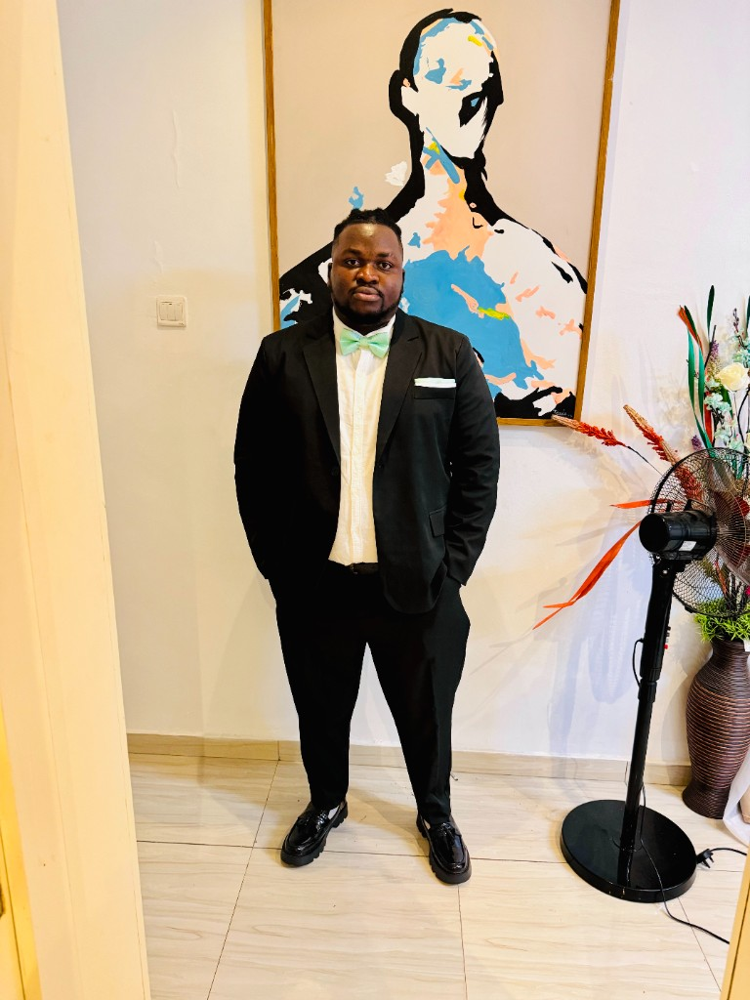

# Wasiu Ibrahim - Software Engineer Portfolio

A professional, modern portfolio website showcasing 11+ years of experience in full-stack development and AI/ML engineering.



## 🚀 Quick Start

### Running Locally
```bash
python -m http.server 8000
```
Then open: http://localhost:8000

### Files Structure
```
portfolio/
├── index.html              # Main HTML structure
├── styles.css              # Styling and animations
├── script.js               # Interactive functionality
├── profile.png             # Professional photo
├── WASIU_IBRAHIM.pdf       # Resume/CV
├── favicon.svg             # Website favicon
└── README.md               # Main documentation
```

## 👨‍💻 About Me
- **Name:** Wasiu Olagunju Ibrahim
- **Location:** Sheffield, UK
- **Email:** wasiu-ibrahim@outlook.com
- **Current Role:** AI Engineer at Mercor
- **Experience:** 11+ years in Full-Stack Development and AI/ML

## ✨ Features

### Professional Sections
- ⚡ **Loading Screen** - Animated preloader
- 🏆 **Achievements Banner** - Key strengths highlight
- 💼 **Services Section** - Detailed offerings
- ⭐ **Testimonials** - Client reviews
- 📞 **Call-to-Action** - Prominent contact section

### Interactive Elements
- 🌓 **Dark/Light Mode** - Theme toggle
- 📊 **Scroll Progress Bar** - Visual progress indicator
- 🎯 **Floating Badges** - Dynamic achievement cards
- ✨ **Smooth Animations** - Scroll-triggered effects
- 📱 **Fully Responsive** - Mobile, tablet, desktop

### Technical Highlights
- Modern gradient design
- Glass morphism effects
- Staggered animations
- Counter animations for stats
- Parallax scrolling effects
- Custom scrollbar
- Professional hover effects

## 🎨 Customization

### Update Your Information
1. **Personal Details**: Edit `index.html` - Update name, email, phone, location
2. **Profile Photo**: Replace `profile.png` with your photo
3. **Resume**: Replace `WASIU_IBRAHIM.pdf` with your CV
4. **Projects**: Update project cards in the Projects section
5. **Experience**: Edit timeline items with your work history
6. **Skills**: Modify skill tags to match your expertise
7. **Testimonials**: Update or remove testimonial cards

### Color Scheme
**Quick color customization** in `styles.css`:
```css
:root {
    --primary-color: #6366f1;      /* Main brand color */
    --secondary-color: #8b5cf6;    /* Accent color */
    --gradient-primary: linear-gradient(135deg, #6366f1 0%, #8b5cf6 100%);
}
```

## 🛠️ Technologies Used
- HTML5
- CSS3 (with CSS Variables)
- JavaScript (Vanilla)
- Font Awesome Icons
- Google Fonts (Inter, Poppins)

## 📱 Responsive Breakpoints
- Desktop: 1024px+
- Tablet: 768px - 1023px
- Mobile: < 768px

## 📄 License
Personal portfolio - feel free to use as inspiration!

## 🤝 Connect
- LinkedIn: [Wasiu Ibrahim](https://www.linkedin.com/in/wasiu-ibrahim-28497a137/)
- GitHub: [DevOlagunju](https://www.github.com/DevOlagunju/)
- Email: wasiu-ibrahim@outlook.com

---
**Built with passion** ❤️ | **Last Updated:** February 2026
